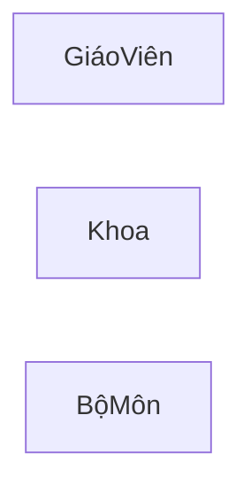
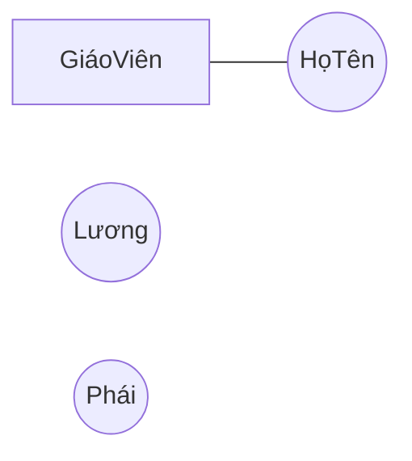

## Table of content

-   [Mô hình dữ liệu cấp cao](#mô-hình-dữ-liệu-cấp-cao)
-   [Các thành phần của một `ERD`](#các-thành-phần-của-một-erd)

## Mô hình dữ liệu cấp cao

Mô hình quan niệm dữ liệu là một loại mô hình dữ liệu cấp cao dùng để thể hiện ngữ nghĩa của dữ liệu.

Nói về mô hình thực thể kết hợp (entity relationship model). Sơ đồ mô tả mô hình thực thể kết hợp được gọi là sơ đồ thực thể kết hợp (entity relationship diagram - hay thường dùng là `ERD`).

## Các thành phần của một `ERD`

### Thực thể và tập các thực thể

Thực thể (`entity`) là một đối tượng ngoài thế giới thực, cụ thể hoặc trừu tượng. Tập thực thể (`entity set`) là tập hợp các thực thể có tính chất giống nhau.

Ký hiệu của một `entity set` là một **hinh chữ nhật**, bên trong là tên của `entity set`, tên của `entity set` là một **danh từ/cụm danh từ**.

### Thuộc tính

Thuộc tính (attribute) là tập hợp các đặc trưng mô tả cho tập thực thể hay mối kết hợp.

Ký hiệu của thuộc tính là một hình **elip** (`eclipse`), bên trong có đặt tên của thuộc tính. Tên của thuộc tính phải là một **danh từ/cụm danh từ**. Thuộc tính gắn vào thực thể bằng một cung **vô hướng**.

Có nhiều loại thuộc tính: đơn, kết hợp, đơn trị, đa trị, và suy diễn.

- Thuộc tính đơn trị chỉ nhận một giá trị.